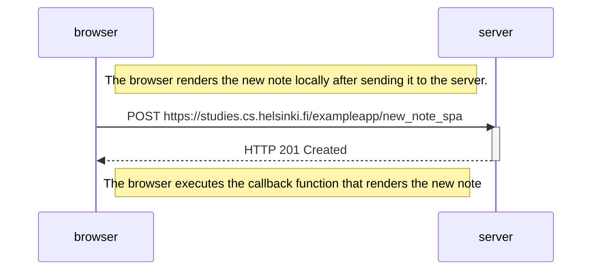

```mermaid
sequenceDiagram
    participant browser
    participant server

    Note right of browser: The browser renders the new note locally after sending it to the server.
    browser->>server: POST https://studies.cs.helsinki.fi/exampleapp/new_note_spa
    activate server
    server-->>browser: HTTP 201 Created
    deactivate server

    Note right of browser: The browser executes the callback function that renders the new note
```